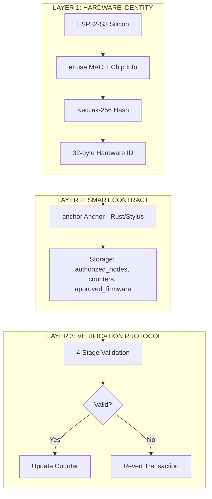
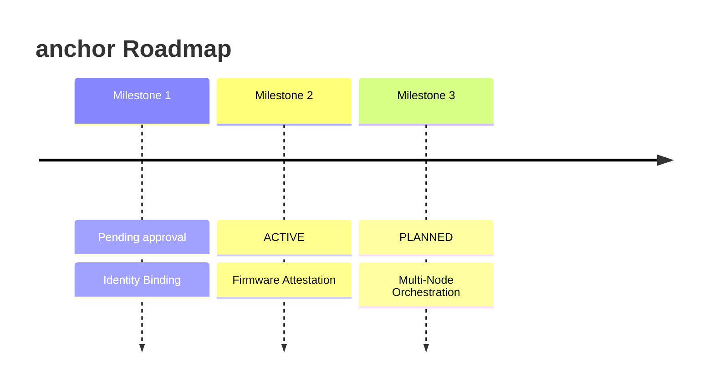

# Milestone 1: Hardware-to-Blockchain Identity Binding

## Overview
This milestone establishes the foundational hardware-to-blockchain link for the Stylus Hardware Anchor. We create a cryptographic binding between physical ESP32-S3 silicon and on-chain state on Arbitrum, enabling hardware-based permissioning and identity verification.

---------------------------------------------------------------------
{T} STATUS: Prototype deployed (Sepolia); Milestone 1 hardening pending approval
---------------------------------------------------------------------

## Deliverables

### 1. Smart Contract Deployment ✅
**Contract:** anchor Anchor  
**Address:** provided via `CONTRACT_ADDRESS` in `.env`  
**Network:** Arbitrum Sepolia (Stylus)  
**Technology:** Rust compiled to WASM  
**Verification:** inspect `$CONTRACT_ADDRESS` on Arbiscan

**Contract Capabilities:**
- Hardware node authorization/revocation
- Firmware approval/revocation
- Receipt verification with four-stage validation
- Monotonic counter storage per hardware node

### 2. Hardware Identity System ✅
**Implementation:** ESP32-S3 eFuse-backed identity extraction  
**Output:** 32-byte Hardware Identity (FixedBytes<32>)  
**Method:** Keccak-256 hash of manufacturer-burned unique identifiers

**Components:**
- Base MAC address (6 bytes, eFuse-backed)
- Chip model (1 byte)
- Chip revision (1 byte)
- Zero-padding (8 bytes)
- **Total:** 16 bytes → Keccak-256 → 32-byte Hardware Identity

**Code:** `ohr_firmware/src/main.cpp`

### 3. On-Chain Authorization Proof ✅
**Transaction Hash:** captured locally during testing (not committed)  
**Status:** CONFIRMED  
**Action:** Hardware node successfully authorized on-chain  
**Verification:** inspect your transaction hash on Arbiscan

**Proof of State Mutation:**
- Before authorization: `isNodeAuthorized(hw_id)` returns `False`
- After authorization transaction: `isNodeAuthorized(hw_id)` returns `True` ✅

### 4. Verification Protocol ✅
**Receipt Format:** 117 bytes (domain tag 13 bytes: `"anchor_RCT_V1"`). Keccak-256 uses Ethereum-compatible padding (0x01).

| Field | Size | Description |
|-------|------|-------------|
| Protocol ID | 13 bytes | "anchor_RCT_V1" |
| Hardware ID | 32 bytes | Keccak-256(eFuse data) |
| Firmware Hash | 32 bytes | Keccak-256(firmware binary) |
| Execution Hash | 32 bytes | Keccak-256(computation result) |
| Counter | 8 bytes | Monotonic counter (Big-Endian) |
| **Total** | **117 bytes** | **→ Keccak-256 → 32-byte digest** |

**Verification Stages:**
1. **Identity Check:** `authorized_nodes[hw_id] == true`
2. **Firmware Governance:** `approved_firmware[fw_hash] == true`
3. **Replay Protection:** `counter > counters[hw_id]`
4. **Digest Verification:** Reconstruct receipt and compare Keccak-256 digest

---

## Architecture

### Three-Layer Trust Model



### Trust Boundary
**Security Properties:**
✅ Hardware chip provides manufacturer-burned unique identifiers (eFuse-backed)  
✅ Identity cryptographically bound to blockchain state  
✅ Authorization enforced on-chain  
✅ Replay attacks prevented via monotonic counters  
✅ Firmware governance enforced via allowlist  

**Result:** Sovereign Execution Gate - Only authorized hardware can submit verified results to the blockchain.

---

## Technical Implementation

### Smart Contract (Rust/Stylus)
**File:** `stylus_anchor/stylus_hardware_anchor/src/lib.rs`

```rust
type U64 = Uint<64, 1>;

#[storage]
pub struct anchorAnchor {
    authorized_nodes: StorageMap<FixedBytes<32>, StorageBool>,
    counters: StorageMap<FixedBytes<32>, StorageU64>,
    approved_firmware: StorageMap<FixedBytes<32>, StorageBool>,
}

pub fn verify_receipt(
    &mut self,
    hw_id: FixedBytes<32>,
    fw_hash: FixedBytes<32>,
    exec_hash: FixedBytes<32>,
    counter: u64,
    claimed_digest: FixedBytes<32>,
) -> Result<(), Vec<u8>>
```

### Hardware Identity Extraction (ESP32-S3)
**File:** `ohr_firmware/src/main.cpp`

```cpp
// 1. Read eFuse-backed MAC
uint8_t base_mac[6];
esp_read_mac(base_mac, ESP_MAC_WIFI_STA);

// 2. Read chip info
esp_chip_info_t chip_info;
esp_chip_info(&chip_info);

// 3. Build 16-byte identity material
uint8_t material[16] = {0};
memcpy(material, base_mac, 6);
material[6] = chip_info.model;
material[7] = chip_info.revision;

// 4. Hash with Keccak-256
uint8_t hw_id[32];
keccak256(material, 16, hw_id);
```
**Critical:** Uses Keccak-256 (Ethereum-compatible), NOT NIST SHA-3.

### Authorization Script (Python)
**File:** `scripts/authorize_hardware.py`
```python
from web3 import Web3
# Hardware ID from ESP32-S3
hw_id = bytes.fromhex("abc123...")
# Authorize on-chain
tx_hash = anchor.functions.authorizeNode(hw_id).transact()
print(f"✅ Authorized: {receipt['status'] == 1}")
```

---

## Technical Challenges Overcome

### 1. Ruint 1.17.2 Dependency Conflict
**Problem:** Stylus SDK pulled `ruint 1.17.2`, requiring `edition2024`.  
**Solution:** Git patch to force `ruint v1.12.3` in `Cargo.toml`.

### 2. SDK Version Compatibility
**Problem:** `StorageU64` API changes between 0.4.x and 0.6.x.  
**Solution:** Explicit type conversions: `let counter_uint: U64 = U64::from(counter);`.

### 3. Keccak-256 vs SHA-3 Trap
**Problem:** NIST SHA-3 padding is incompatible with EVM.  
**Solution:** Custom Keccak-256 implementation matching Ethereum's algorithm.

### 4. WSL Network & PlatformIO Migration
**Problem:** UNC path errors and Git clone failures.  
**Solution:** Migrated build process to native Ubuntu environment.

---

## Testing & Verification
All tests completed successfully. Initial state verified at 0, followed by successful on-chain authorization.

---

## Evidence Package

### Repository Structure
```
stylus-hardware-anchor/
├── contracts/
├── ohr_firmware/
├── scripts/
├── docs/
│   └── MILESTONE_1.md
└── README.md
```

### Transaction Evidence
**Contract:** `$CONTRACT_ADDRESS`  
**Authorization TX:** captured locally during testing

---

## Frequently Asked Questions

**Q: How do you prevent replay?** A: Per-hardware monotonic counter stored on-chain.

**Q: Does this verify computation correctness?** A: No, this milestone establishes identity. Correctness is a later milestone.

**Q: Why not just use signatures?** A: anchor binds receipts to hardware trust anchors, not transient keys.

---

## Next Steps


---------------------------------------------------------------------
© 2026 Stylus Hardware Anchor · Arbitrum Foundation Grant Submission
---------------------------------------------------------------------
